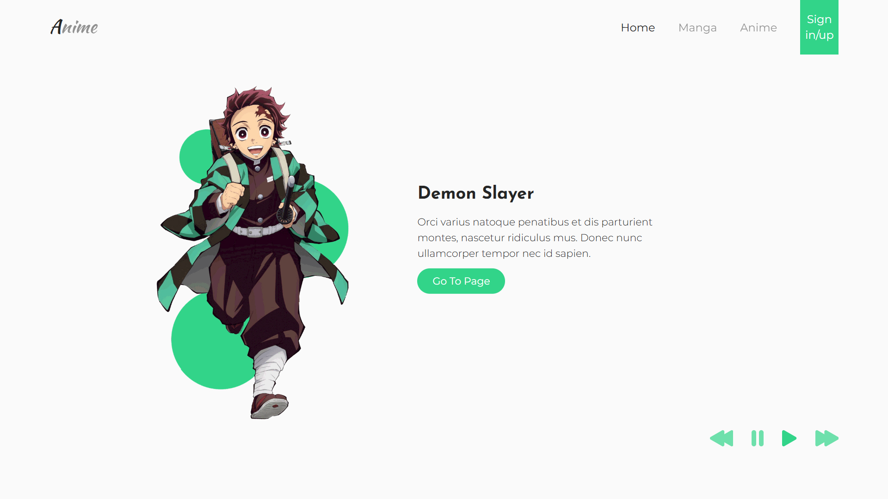

# Cool slider effect

Live demo: [cool-slider-effect.vercel.app](https://cool-slider-effect.vercel.app)

This is one of my first projects that made me really proud of myself, and at the time it was definitely one of the most challenging too. The main focus of this single page HTML web app is the character slider effect at the top of the page. I used a SVG to create this effect and I learned a lot while working with SVGs.

Adding touch gesture interactions for small screens was another cool feature I implemented here. This is one of the first responsive, mobile friendly designs I developed which even includes a responsive navbar with a hamburger menu for small screens.

## Screenshots

